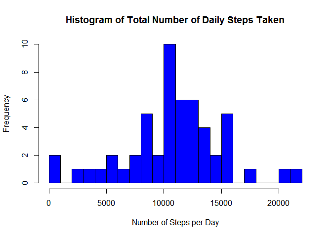
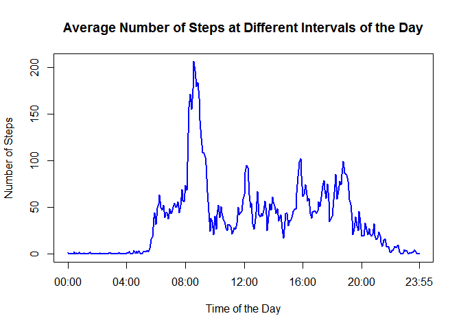
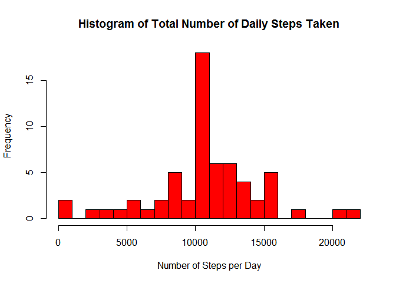
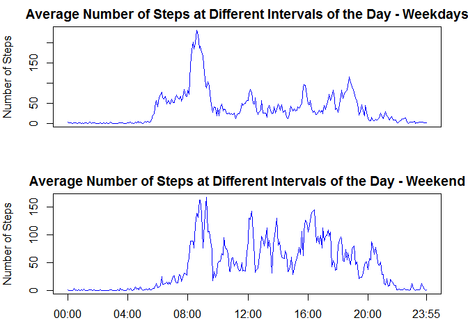

Introduction
------------

It is now possible to collect a large amount of data about personal
movement using activity monitoring devices such as a
[Fitbit](http://www.fitbit.com), [Nike
Fuelband](http://www.nike.com/us/en_us/c/nikeplus-fuelband), or [Jawbone
Up](https://jawbone.com/up). These type of devices are part of the
"quantified self" movement -- a group of enthusiasts who take
measurements about themselves regularly to improve their health, to find
patterns in their behavior, or because they are tech geeks. But these
data remain under-utilized both because the raw data are hard to obtain
and there is a lack of statistical methods and software for processing
and interpreting the data.

This assignment makes use of data from a personal activity monitoring
device. This device collects data at 5 minute intervals through out the
day. The data consists of two months of data from an anonymous
individual collected during the months of October and November, 2012 and
include the number of steps taken in 5 minute intervals each day.

Data
----

The data for this assignment can be downloaded from the course web site:

-   Dataset: [Activity monitoring
    data](https://d396qusza40orc.cloudfront.net/repdata%2Fdata%2Factivity.zip)
    \[52K\]

The variables included in this dataset are:

-   **steps**: Number of steps taking in a 5-minute interval (missing
    values are coded as `NA`)

-   **date**: The date on which the measurement was taken in YYYY-MM-DD
    format

-   **interval**: Identifier for the 5-minute interval in which
    measurement was taken

The dataset is stored in a comma-separated-value (CSV) file and there
are a total of 17,568 observations in this dataset.

Assignment
----------

Pakages used:

    suppressWarnings(suppressMessages(library(dplyr)))

### Loading and preprocessing the data:

    dataUrl <- "https://d396qusza40orc.cloudfront.net/repdata%2Fdata%2Factivity.zip"

    if(!file.exists("./data")){dir.create("./data")}
    download.file(dataUrl, destfile="./data/activity.zip")
    unzip("./data/activity.zip", exdir = "./data")

    # read required data from file--------------------------------------------------
    raw_data <- read.csv("./data/activity.csv", stringsAsFactors=FALSE, header=TRUE)

    data <- raw_data

    # convert the date column to date class
    data$date <- as.Date(data$date, format="%Y-%m-%d")

### What is mean total number of steps taken per day?

(for this part of the assignment we will ignore the missing values in
the dataset).

    # Process/transform the data into a format suitable for your analysis-----------
    data <- na.omit(data)
    group_data <- group_by(data, date)
    data_per_day <- summarise(group_data, steps_per_day=sum(steps))

1.  Make a histogram of the total number of steps taken each day:

<!-- -->

    with(data_per_day, hist(steps_per_day, breaks=20, col="blue", 
        main="Histogram of Total Number of Daily Steps Taken", 
        xlab="Number of Steps per Day"))

1.  Calculate and report the mean and median total number of steps taken
    per day:

<!-- -->

    meanSteps <- mean(data_per_day$steps_per_day)
    meanSteps

    ## [1] 10766.19

    medianSteps <- median(data_per_day$steps_per_day)
    medianSteps

    ## [1] 10765

The mean of total number of steps taken per day is: 10766.19

The mean of total number of steps taken per day is: 10765

### What is the average daily activity pattern?

1.  Make a time series plot (i.e. type = "l") of the 5-minute interval
    (x-axis) and the average number of steps taken, averaged across all
    days (y-axis)

<!-- -->

    # Process/transform the data into a format suitable for your analysis-----------
    group_data2 <- group_by(data, interval)
    data_interval <- summarise(group_data2, mean_steps_per_interval=mean(steps))

By looking at data we can see that 5-minute interval recorded in format
that mixes minutes and hours. For example, the the 55-munute mark is
recorded as 55, but the next value recorded as 100, which means "1 hour
and zero minutes", so there is a jump in numerical value every hour. To
make it more convenient to work with the time data, we will add a column
with a continuous 5-minutes interval scale.

    data_interval$interval_5minutes <- seq(from = 0, to = 1435, by = 5)

Make a time series plot.

    with(data_interval, plot(interval_5minutes, mean_steps_per_interval, type = "l", 
        col='blue',
        main="Average Number of Steps at Different Intervals of the Day", 
        ylab="Number of Steps", 
        xlab="Time of the Day", lwd=2, xaxt = "n"))
        axis(side = 1, at=c(0, 240, 480, 720, 960, 1200, 1435),
        labels=c("00:00","04:00","08:00","12:00","16:00","20:00","23:55"))

1.  Which 5-minute interval, on average across all the days in the
    dataset, contains the maximum number of steps?

<!-- -->

    max_steps <- data_interval[which.max(data_interval$mean_steps_per_interval),]$interval_5minutes
    max_steps

    ## [1] 515

The interval at 515-520 minutes contains maximal average number of
steps, that corresponds to 8:35-8:40 AM time-interval.

### Imputing missing values.

There are a number of days/intervals where there are missing values
(coded as NA). The presence of missing days may introduce bias into some
calculations or summaries of the data.

1.  Calculate and report the total number of missing values in the
    dataset (i.e. the total number of rows with NAs)

<!-- -->

    sum(is.na(raw_data$steps))

    ## [1] 2304

There are 2304 missing values in the dataset.

1.  Devise a strategy for filling in all of the missing values in the
    dataset.

To fill missing values in the dataset we will use average of the 5-min
intervals across days.

1.  Create a new dataset with the missing data filled in.

<!-- -->

    new_data <- raw_data
    new_data$date <- as.Date(new_data$date, format="%Y-%m-%d")

    # fill missing values
    na_idx <- which(is.na(new_data$steps))

    for (i in na_idx){
        new_data$steps[i] <- data_interval$mean_steps_per_interval[
            match(new_data$interval[i], data_interval$interval)]
    }

1.  Make a histogram of the total number of steps taken each day and
    Calculate and report the mean and median total number of steps taken
    per day.

<!-- -->

    # Process/transform the data into a format suitable for your analysis-----------
    group_data3 <- group_by(new_data, date)
    new_data_per_day <- summarise(group_data3, steps_per_day=sum(steps))

    # Make a histogram
    with(new_data_per_day, hist(steps_per_day, breaks=20, col="red",
         main="Histogram of Total Number of Daily Steps Taken", 
         xlab="Number of Steps per Day"))

    new_meanSteps <- mean(new_data_per_day$steps_per_day)
    new_meanSteps

    ## [1] 10766.19

    new_medianSteps <- median(new_data_per_day$steps_per_day)
    new_medianSteps

    ## [1] 10766.19

The new mean of total number of steps taken per day is: 10766.19

The new median of total number of steps taken per day is: 10766.19

We can see that both mean and median values have increased and their
values become equal.

### Are there differences in activity patterns between weekdays and weekends?

1.  Create two new datasets corresponding to "weekdays" and "weekends".

<!-- -->

    vector_week <- !(weekdays(new_data$date) %in% c('Saturday','Sunday'))
    vector_weekend <- weekdays(new_data$date) %in% c('Saturday','Sunday')

    new_data_week <- new_data[vector_week,]
    new_data_weekend <- new_data[vector_weekend,]

1.  Make a panel plot containing a time series plot (i.e. type = "l") of
    the 5-minute interval (x-axis) and the average number of steps
    taken, averaged across all weekday days or weekend days (y-axis).

<!-- -->

    # Process/transform the data into a format suitable for your analysis-----------
    group_data4 <- group_by(new_data_week, interval)
    new_data_week_interval <- summarise(group_data4, mean_steps_per_interval=mean(steps))
    new_data_week_interval$interval_5minutes <- seq(from = 0, to = 1435, by = 5)

    group_data5 <- group_by(new_data_weekend, interval)
    new_data_weekend_interval <- summarise(group_data5, mean_steps_per_interval=mean(steps))
    new_data_weekend_interval$interval_5minutes <- seq(from = 0, to = 1435, by = 5)

    # Make a plot
    par(mfrow = c(2, 1), mar = c(3,4,2,2))

    with(new_data_week_interval, plot(interval_5minutes, mean_steps_per_interval, 
        type = "l", col='blue',
        main="Average Number of Steps at Different Intervals of the Day - Weekdays", 
        ylab="Number of Steps", xlab='', lwd=1, xaxt = "n"))

    with(new_data_weekend_interval, plot(interval_5minutes, mean_steps_per_interval, 
        type = "l", col='blue',
        main="Average Number of Steps at Different Intervals of the Day - Weekend", 
        ylab="Number of Steps", xlab="Time of the Day", lwd=1, xaxt = "n"))

    axis(side = 1, at=c(0, 240, 480, 720, 960, 1200, 1435),
        labels=c("00:00","04:00","08:00","12:00","16:00","20:00","23:55"))

From the figure above we can see that there is a difference in activity
patterns between weekdays and weekends. In particular, walking activity
on the weekends is more evenly distributed among different intervals
then on weekdays.
