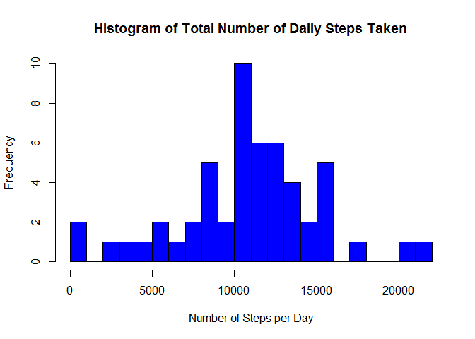
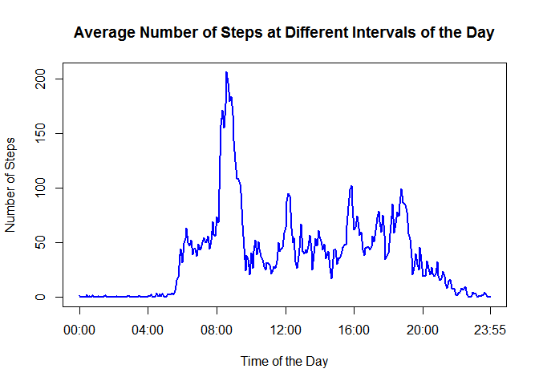
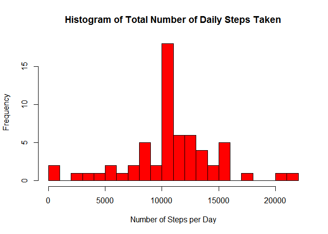

Introduction
------------

It is now possible to collect a large amount of data about personal movement using activity monitoring devices such as a [Fitbit](http://www.fitbit.com), [Nike Fuelband](http://www.nike.com/us/en_us/c/nikeplus-fuelband), or [Jawbone Up](https://jawbone.com/up). These type of devices are part of the "quantified self" movement -- a group of enthusiasts who take measurements about themselves regularly to improve their health, to find patterns in their behavior, or because they are tech geeks. But these data remain under-utilized both because the raw data are hard to obtain and there is a lack of statistical methods and software for processing and interpreting the data.

This assignment makes use of data from a personal activity monitoring device. This device collects data at 5 minute intervals through out the day. The data consists of two months of data from an anonymous individual collected during the months of October and November, 2012 and include the number of steps taken in 5 minute intervals each day.

Data
----

The data for this assignment can be downloaded from the course web site:

-   Dataset: [Activity monitoring data](https://d396qusza40orc.cloudfront.net/repdata%2Fdata%2Factivity.zip) \[52K\]

The variables included in this dataset are:

-   **steps**: Number of steps taking in a 5-minute interval (missing values are coded as `NA`)

-   **date**: The date on which the measurement was taken in YYYY-MM-DD format

-   **interval**: Identifier for the 5-minute interval in which measurement was taken

The dataset is stored in a comma-separated-value (CSV) file and there are a total of 17,568 observations in this dataset.

Assignment
----------

Pakages used:

``` r
suppressMessages(library(dplyr))
```

    ## Warning: package 'dplyr' was built under R version 3.4.2

### Loading and preprocessing the data:

``` r
dataUrl <- "https://d396qusza40orc.cloudfront.net/repdata%2Fdata%2Factivity.zip"

if(!file.exists("./data")){dir.create("./data")}
download.file(dataUrl, destfile="./data/activity.zip")
unzip("./data/activity.zip", exdir = "./data")

# read required data from file--------------------------------------------------
raw_data <- read.csv("./data/activity.csv", stringsAsFactors=FALSE, header=TRUE)

# Process/transform the data into a format suitable for your analysis-----------
data <- raw_data

# convert the date column to date class
data$date <- as.Date(data$date, format="%Y-%m-%d")
```

### What is mean total number of steps taken per day?

(for this part of the assignment we will ignore the missing values in the dataset).

``` r
data <- na.omit(data)
group_data <- group_by(data, date)
data_per_day <- summarise(group_data, steps_per_day=sum(steps))
```

1.  Make a histogram of the total number of steps taken each day:

``` r
with(data_per_day, hist(steps_per_day, breaks=20, col="blue", 
    main="Histogram of Total Number of Daily Steps Taken", 
    xlab="Number of Steps per Day"))
```



1.  Calculate and report the mean and median total number of steps taken per day:

``` r
meanSteps <- mean(data_per_day$steps_per_day)
meanSteps
```

    ## [1] 10766.19

``` r
medianSteps <- median(data_per_day$steps_per_day)
medianSteps
```

    ## [1] 10765

The mean of total number of steps taken per day is: 10766.19

The mean of total number of steps taken per day is: 10765

### What is the average daily activity pattern?

1.  Make a time series plot (i.e. type = "l") of the 5-minute interval (x-axis) and the average number of steps taken, averaged across all days (y-axis)

``` r
group_data2 <- group_by(data, interval)
data_interval <- summarise(group_data2, mean_steps_per_interval=mean(steps))
```

By looking at data we can see that 5-minute interval recorded in format that mixes minutes and hours. For example, the the 55-munute mark is recorded as 55, but the next value recorded as 100, which means "1 hour and zero minutes", so there is a jump in numerical value every hour. To make it more convenient to work with the time data, we will add a column with a continuous 5-minutes interval scale.

``` r
data_interval$interval_5minutes <- seq(from = 0, to = 1435, by = 5)
```

Make a time series plot.

``` r
with(data_interval, plot(interval_5minutes, mean_steps_per_interval, type = "l", 
    col='blue',
    main="Average Number of Steps at Different Intervals of the Day", 
    ylab="Number of Steps", 
    xlab="Time of the Day", lwd=2, xaxt = "n"))
    axis(side = 1, at=c(0, 240, 480, 720, 960, 1200, 1435),
    labels=c("00:00","04:00","08:00","12:00","16:00","20:00","23:55"))
```



1.  Which 5-minute interval, on average across all the days in the dataset, contains the maximum number of steps?

``` r
max_steps <- data_interval[which.max(data_interval$mean_steps_per_interval),]$interval_5minutes
max_steps
```

    ## [1] 515

The interval at 515-520 minutes contains maximal average number of steps, that corresponds to 8:35-8:40 AM time-interval.

### Imputing missing values.

There are a number of days/intervals where there are missing values (coded as NA). The presence of missing days may introduce bias into some calculations or summaries of the data.

1.  Calculate and report the total number of missing values in the dataset (i.e. the total number of rows with NAs)

``` r
sum(is.na(raw_data$steps))
```

    ## [1] 2304

There are 2304 missing values in the dataset.

1.  Devise a strategy for filling in all of the missing values in the dataset.

To fill missing values in the dataset we will use average of the 5-min intervals across days.

1.  Create a new dataset with the missing data filled in.

``` r
new_data <- raw_data
new_data$date <- as.Date(new_data$date, format="%Y-%m-%d")

na_idx <- which(is.na(new_data$steps))

for (i in na_idx){
    new_data$steps[i] <- data_interval$mean_steps_per_interval[
        match(new_data$interval[i], data_interval$interval)]
}
```

1.  Make a histogram of the total number of steps taken each day and Calculate and report the mean and median total number of steps taken per day.

``` r
group_data3 <- group_by(new_data, date)
new_data_per_day <- summarise(group_data3, steps_per_day=sum(steps))

with(new_data_per_day, hist(steps_per_day, breaks=20, col="red",
     main="Histogram of Total Number of Daily Steps Taken", 
     xlab="Number of Steps per Day"))
```



``` r
new_meanSteps <- mean(new_data_per_day$steps_per_day)
new_meanSteps
```

    ## [1] 10766.19

``` r
new_medianSteps <- median(new_data_per_day$steps_per_day)
new_medianSteps
```

    ## [1] 10766.19

The new mean of total number of steps taken per day is: 10766.19

The new median of total number of steps taken per day is: 10766.19

We can see that both mean and median values have increased and their values become equal.

### Are there differences in activity patterns between weekdays and weekends?

1.  Create two new datasets corresponding to "weekdays" and "weekends".

``` r
vector_week <- !(weekdays(new_data$date) %in% c('Saturday','Sunday'))
vector_weekend <- weekdays(new_data$date) %in% c('Saturday','Sunday')

new_data_week <- new_data[vector_week,]
new_data_weekend <- new_data[vector_weekend,]
```

1.  Make a panel plot containing a time series plot (i.e. type = "l") of the 5-minute interval (x-axis) and the average number of steps taken, averaged across all weekday days or weekend days (y-axis).

``` r
group_data4 <- group_by(new_data_week, interval)
new_data_week_interval <- summarise(group_data4, mean_steps_per_interval=mean(steps))
new_data_week_interval$interval_5minutes <- seq(from = 0, to = 1435, by = 5)

group_data5 <- group_by(new_data_weekend, interval)
new_data_weekend_interval <- summarise(group_data5, mean_steps_per_interval=mean(steps))
new_data_weekend_interval$interval_5minutes <- seq(from = 0, to = 1435, by = 5)
```

Make plot.

``` r
par(mfrow = c(2, 1), mar = c(3,4,2,1))

with(new_data_week_interval, plot(interval_5minutes, mean_steps_per_interval, 
    type = "l", col='blue',
    main="Average Number of Steps at Different Intervals of the Day - Weekdays", 
    ylab="Number of Steps", xlab='', lwd=1, xaxt = "n"))

with(new_data_weekend_interval, plot(interval_5minutes, mean_steps_per_interval, 
    type = "l", col='blue',
    main="Average Number of Steps at Different Intervals of the Day - Weekend", 
    ylab="Number of Steps", xlab="Time of the Day", lwd=1, xaxt = "n"))

axis(side = 1, at=c(0, 240, 480, 720, 960, 1200, 1435),
    labels=c("00:00","04:00","08:00","12:00","16:00","20:00","23:55"))
```


From the figure above we can see that there is a difference in activity patterns between weekdays and weekends. In particular, walking activity on the weekends is more evenly distributed among different intervals then on weekdays.
